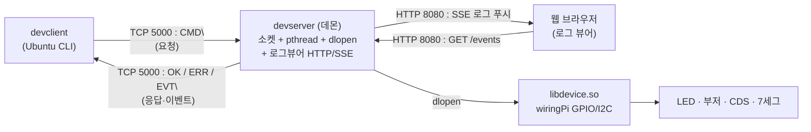

# TCP 기반 원격 장치 제어 시스템

x86-64 리눅스(Ubuntu) 클라이언트에서 **TCP 통신**으로 Raspberry Pi에 연결된 장치
(LED · 부저 · 조도센서 · 7세그먼트)를 원격 제어하는 시스템.
VEDA 리눅스 프로그래밍 심화 실습 평가 과제.

- **서버**: RPi의 raw TCP 소켓 **데몬 프로세스**. 연결당 pthread, 장치 제어 로직은
  `libdevice.so`를 `dlopen()`으로 **런타임 동적 로딩**. 로그는 `syslog`.
- **클라이언트**: Ubuntu CLI 프로그램(`devclient`). 송신 + 수신 스레드 구조,
  **SIGINT만 정상 종료**(그 외 시그널 무시), 번호식 계층 메뉴.
- **동적 라이브러리**: 장치 제어를 `libdevice.so`로 분리 → `.so`만 교체해 기능 업그레이드.

---

## 시스템 구성

| 구분 | 서버 | 클라이언트 |
|------|------|-----------|
| 하드웨어 | Raspberry Pi 4 | x86-64 PC/노트북 |
| OS | Raspberry Pi OS | Ubuntu Linux |
| 라이브러리 | wiringPi(GPIO/I2C), pthread, dl | pthread |
| 언어 | C / gcc | C / gcc |



---

## 빌드

이 프로젝트는 **하나의 루트 Makefile**로 3개 산출물(`devserver`·`libdevice.so`·`devclient`)을
빌드한다. 빌드 방식은 두 가지다.

| 방식 | 빌드 위치 | 언제 쓰나 |
|------|----------|----------|
| **네이티브** | RPi 위에서 직접 | RPi에서 gcc·wiringPi가 바로 되는 가장 단순한 경우 |
| **크로스** | Ubuntu 빌드머신 → aarch64 | RPi가 느리거나, Ubuntu에서 한 번에 빌드·전송하고 싶을 때 |

### 산출물

| 바이너리 | 빌드 대상 | 설명 | 의존성 |
|---------|----------|------|--------|
| `devserver` | RPi | TCP 데몬 서버 | 소켓/pthread/dl (의존성 없이 크로스 가능) |
| `libdevice.so` | RPi | 장치 제어 동적 라이브러리 | **wiringPi 필요** (`softPwm`/`softTone`/I2C) |
| `devclient` | Ubuntu 호스트 | TCP 클라이언트 | pthread (항상 native gcc로 빌드) |

> `devclient`는 어느 방식이든 **빌드 호스트(Ubuntu x86-64)용 native**로만 빌드된다
> (Makefile의 `HOSTCC=gcc`). RPi에는 보내지 않는다.

### 방식 1 — 네이티브 (RPi 위에서 직접 빌드)

RPi에 소스를 올린 뒤 RPi 셸에서:

```bash
# 사전 준비 (최초 1회): 빌드 도구 + wiringPi + I2C 활성화
sudo apt update
sudo apt install -y build-essential wiringpi    # wiringpi 패키지가 없으면 아래 "wiringPi 설치" 참고
sudo raspi-config nonint do_i2c 0               # I2C 인터페이스 켜기 (CDS/PCF8591용)

# 빌드
make CROSS_COMPILE= WIRINGPI=                    # 시스템 경로의 wiringPi 사용 → 세 산출물 모두 생성
make run                                         # 빌드 후 ./devserver 5000 실행 (데몬, 로그뷰어 8080)
```

> `CROSS_COMPILE=` `WIRINGPI=` 를 **빈 값으로 명시**해야 한다. 비우면 `gcc`(native)와
> 시스템에 설치된 wiringPi(`-lwiringPi`)를 그대로 쓴다. 생략하면 Makefile 기본값이
> 크로스 툴체인(`aarch64-linux-gnu-gcc`)을 찾으려다 실패한다.

### 방식 2 — 크로스 컴파일 (Ubuntu 빌드머신 → aarch64 RPi 타겟)

서버/라이브러리만 aarch64로 크로스, 클라이언트는 호스트 native:

```bash
# 사전 준비 (최초 1회): aarch64 크로스 툴체인 + 타겟용 wiringPi
sudo apt update
sudo apt install -y gcc-aarch64-linux-gnu        # aarch64-linux-gnu-gcc 제공
# 타겟(aarch64)용 wiringPi 헤더/.so 를 준비 → WIRINGPI= 로 경로 지정 (아래 구조 참고)

# 빌드
make CROSS_COMPILE=aarch64-linux-gnu- WIRINGPI=/usr/aarch64-linux-gnu
```

> `WIRINGPI=` 경로 구조: `$(WIRINGPI)/include/{wiringPi.h,softPwm.h,softTone.h}`,
> `$(WIRINGPI)/lib/libwiringPi.so`
>
> 링크 시 `undefined reference to 'crypt'` 등이 나오면(정적 wiringPi 등):
> `make ... WPI_LIBS="-lwiringPi -lcrypt -lm -lrt"`

### wiringPi 설치 (RPi에 패키지가 없을 때)

최신 Raspberry Pi OS는 `apt`에 `wiringpi`가 없을 수 있다. 그 경우 소스로 설치:

```bash
git clone https://github.com/WiringPi/WiringPi.git
cd WiringPi && ./build
gpio -v        # 설치 확인
```

### 기타 타겟

```bash
make clean      # 산출물(devserver/devclient/libdevice.so) 삭제
```

> `devserver`는 데몬화 전 `./libdevice.so`의 절대경로를 `realpath`로 고정한 뒤 `dlopen`하므로
> **실행 디렉토리에 `libdevice.so`가 있어야** 한다.

---

## RPi로 전송 (크로스 빌드 시)

크로스 빌드한 `devserver`·`libdevice.so`와 로그뷰어 UI `index.html`을 RPi로 보낸다.

```bash
# Makefile 자동 전송 (빌드 후 scp) — 기본 대상 pi@<Makefile의 PI_HOST>:~/linux_project
make send PI_HOST=<RPi-IP>

# 대상 변경
make send PI_HOST=<RPi-IP> PI_USER=pi PI_DIR=~/app
```

전송되는 파일은 `devserver libdevice.so index.html` 세 개다(`devclient`은 Ubuntu 호스트용이라 제외).
수동으로 보내려면:

```bash
scp devserver libdevice.so index.html pi@<RPi-IP>:~/linux_project/
```

> **반드시 세 파일을 RPi의 같은 디렉토리에 둬야** 한다. `devserver`는 같은 디렉토리의
> `./libdevice.so`를 `dlopen`하고, 로그뷰어는 같은 디렉토리의 `index.html`을 서빙한다
> (`index.html`이 없으면 내장 폴백 페이지 사용).

---

## 실행

### 1) 서버 (RPi)

```bash
cd ~/linux_project              # devserver·libdevice.so·index.html 이 있는 디렉토리
./devserver [port] [log_port]   # 기본: 5000(TCP) / 8080(로그뷰어). 예: ./devserver 5000 9090
```

- 즉시 **데몬으로 백그라운드 전환**(`fork`/`setsid`)되어 프롬프트가 바로 돌아온다.
- 로그는 `syslog`로 기록 → `sudo journalctl -t devserver -f` 또는 `tail -f /var/log/syslog`로 확인.
- 정지: `pkill devserver`.

### 2) 클라이언트 (Ubuntu)

```bash
./devclient <서버-IP> [port]    # 기본 port 5000. 예: ./devclient 10.144.236.106 5000
```

- 번호식 **계층 메뉴**로 명령을 선택해 서버로 전송한다.
- **Ctrl+C(SIGINT)** 로만 정상 종료(`QUIT` 전송 후 소켓 정리). 그 외 시그널은 무시 → 강제 종료 방지.
- **CDS 자동연동**: 켜면 매초 `EVT CDS`를 표시하는 모니터링 화면으로 들어가고,
  **Enter**를 누르면 `CDS OFF`를 보내고 메뉴로 복귀한다(별도 OFF 메뉴 없음).

### 3) 로그 뷰어 (브라우저)

- `http://<RPi-IP>:8080` 접속 → 서버 로그 **실시간 푸시(SSE)** 확인. 일시정지·지우기·다시불러오기 지원.

### 빠른 점검 (클라이언트 없이)

```bash
# 서버가 떴는지 / 프로토콜 응답 확인
nc <RPi-IP> 5000        # 연결 후 STATUS 입력 → OK STATUS ... 응답
```

---

## 통신 프로토콜 (TCP 텍스트 라인)

- 요청(C→S): `<CMD> [ARG]\n`
- 응답(S→C): `OK ...` / `ERR ...`
- 비동기 이벤트: `EVT ...`

| 명령 | 동작 | 응답 |
|------|------|------|
| `LED ON` / `LED OFF` | 점등 / 소등 | `OK LED ON` / `OK LED OFF` |
| `LED HIGH\|MID\|LOW` | 밝기 3단계 (PWM `softPwm`) | `OK LED HIGH\|MID\|LOW` |
| `BUZZER ON` / `BUZZER OFF` | 저장된 멜로디 재생 / 정지 (passive, `softTone`) | `OK BUZZER ON\|OFF` |
| `CDS ON` / `CDS OFF` | 자동 조도 연동 (어두우면 LED ON) + 매초 `EVT CDS` (읽기 실패 시 `EVT CDS ERROR` 후 자동 종료) | `OK CDS ON\|OFF` |
| `CDS READ` | 1회 조회 | `OK CDS <값> <DARK\|LIGHT> TH <임계값>` |
| `CDS THRESHOLD <0-255>` | 임계값 설정 (클라이언트 제어) | `OK CDS THRESHOLD <값>` |
| `FND <0-9>` | 해당 숫자부터 1초마다 -1 카운트다운 → 0 도달 시 부저 + `EVT FND DONE` | `OK FND START` (사용 중이면 `ERR FND_BUSY`) |
| `FND STOP` | 카운트다운 정지 | `OK FND STOP` (사용 중이면 `ERR FND_BUSY`) |
| `STATUS` | 모드 상태 조회 | `OK STATUS cds=<0\|1> fnd=<0\|1> buzzer=<0\|1>` |
| `QUIT` | 연결 종료 | `OK BYE` |

이벤트 예: `EVT CDS <0~255> <DARK|LIGHT>` (매초), `EVT CDS ERROR` (조도 읽기 실패 → 자동 모드 종료), `EVT FND DONE`

> **조도값**: PCF8591 ADC(YL-40) AIN0 아날로그 `0~255`. `값 >= 임계값`이면 **어두움(DARK)** 으로 판정.
> I2C 읽기가 실패해 `-1`이 나오면(센서 미연결 등) `EVT CDS ERROR`를 한 번 보내고 자동 모드를 종료한다(무한 `-1` 스트림 방지).
> **FND 다중 클라이언트**: 7세그는 1개뿐이라, 다른 클라이언트가 카운트다운 중이면 `FND`/`FND STOP`은 `ERR FND_BUSY`로 거부된다(소유 클라이언트만 제어, 연결 종료 시 자동 해제).

---

## 디렉토리 구조

```
Makefile
client/client.c                                          # devclient (Ubuntu CLI)
server/{server.h, main.c, binding.c, command.c, modes.c, weblog.c}   # devserver
lib/{device.h, common.c, led.c, buzzer.c, cds.c, fnd.c}              # libdevice.so (dlopen)
```

- **서버 모듈**: `main`(accept·데몬) / `binding`(dlopen) / `command`(프로토콜 파싱) /
  `modes`(CDS·FND·부저 스레드) / `weblog`(HTML 실시간 로그)
- **라이브러리 모듈**: `common`(init/cleanup) / `led` / `buzzer` / `cds` / `fnd`

---

## 하드웨어 결선 (RPi, wiringPi 핀 번호)

| 장치 | 핀 | 비고 |
|------|----|----|
| LED | wPi 1 | `softPwm` 밝기 제어 |
| 부저 | wPi 2 | passive 압전, `softTone` |
| 7세그먼트 | SN74LS47 BCD A~D = wPi 21~24, BLANK = wPi 25 | 공통 애노드, active-LOW |
| 조도센서 | PCF8591 I2C (기본 `0x48`) — SDA=wPi8, SCL=wPi9, 조도출력→AIN0 | `i2cdetect -y 1`로 주소 확정 |

> SN74LS47의 `L̄T̄`·`R̄B̄Ī`·`VCC`·`COM`은 5V 직결 (`L̄T̄` floating 시 전 세그먼트 ghosting 발생).
> CDS 극성(`값 >= 임계값` = 어두움)은 분압 결선 방향에 따라 반전될 수 있어 실측 후 비교부호 확정.

---

## 주요 특징

- raw TCP 소켓(`socket/bind/listen/accept`) + 연결당 **pthread** 멀티클라이언트
- 서버 **데몬화**(`fork`/`setsid`) + `syslog` 로깅
- 장치 제어 로직 **런타임 동적 로딩**(`dlopen`/`dlsym`/`dlclose`, `-ldl`)
- 모드 스레드(CDS·FND·부저)와 GPIO 공유 자원 **뮤텍스 보호**
- 클라이언트 **SIGINT만 정상 종료**, 그 외 시그널 무시 → 강제 종료 방지
- (추가기능) **HTML 실시간 서버 로그 뷰어** — 2번째 포트(기본 8080), **SSE 실시간 푸시**(`/events`) + 외부 `index.html`(일시정지·지우기·다시불러오기), `/log` 폴백
